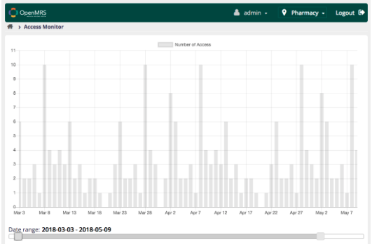

# What is OpenMRS Acess Monitor Module ? 
- The aim of our project was to create a new module for the OpenMRS system that would allow a system admin to monitor and view attempts to access the system and help identify potential malicious uses of the software, with one of the main concerns being the protection of patient privacy.
- To accomplish this, we are logging various method calls through Aspect Oriented Programming through the Java Spring framework. Spring allows a programmer to wrap specific classes, known as advice classes, around method calls made via an interface during program execution, and even prevent execution of the intercepted code and return a dummy value, if desired.
- To support this, we also created a database table through liquibase to store the records of access attempts, which is defined and managed by the Hibernate ORM. These records are then recalled, parsed, and displayed in a graph format using the Spring MVC Framework, Ajax, and JavaScript, the display of which can be changed dynamically in order to make it easier for patterns to be detected in the display of record accesses. While we had initially planned for multiple graphs and filters, this ended up being too ambitious for the timeframe of the project, and we dropped those features.

# Use Case 

# Screenshots 

  
  
  

  
  

# Class Diagram 

